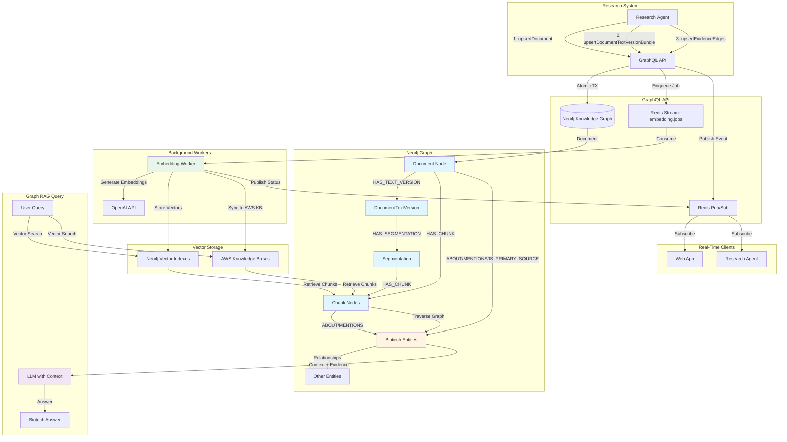

# Biotech Knowledge Graph API

A Neo4j-powered GraphQL API modeling the biotech industry for both web application use and LLM-powered research ingestion systems. This API serves as the unified boundary for biotech knowledge graph operations, document ingestion, and future user-facing AI assistant capabilities. The system enables powerful **Graph RAG (Retrieval Augmented Generation)** by linking research documents and their chunks to biotech entities through evidence relationships.

## Overview

This GraphQL API is the core backend for a comprehensive biotech knowledge platform that will combine:

1. **The Knowledge Graph of the Biotech Industry** - A comprehensive Neo4j knowledge graph modeling labs, panels, biomarkers, products, organizations, studies, and their complex relationships
2. **User and AI Assistant API** - User notes, protocols, saved entities, recommendations, trending analysis, personalized assistance, and real-time messaging

The API uses a **Service Layer (Application Service) pattern** within a modular, API-centered architecture. The GraphQL API serves as a single boundary exposing two core domains—User Profile data in Postgres (via Prisma/SQL) and the biotech Knowledge Graph in Neo4j—while keeping business logic in domain-focused services (pure logic functions/use-cases) that are invoked by thin GraphQL resolvers. Multiple clients (the web app and the LLM-powered ingestion/research system) integrate through that same API boundary, functioning like a Backend-for-Frontend/API Gateway-style façade over polyglot persistence.

## Architecture

### Core Pattern

**Service Layer Architecture with Modular GraphQL Schema**

- **GraphQL API** - Single boundary exposing biotech knowledge graph operations
- **Service Layer** - Domain-focused services containing business logic and use-cases
- **Thin Resolvers** - GraphQL resolvers that delegate to service layer functions
- **Polyglot Persistence** - Neo4j for knowledge graph, Postgres for user profiles
- **Asynchronous Workflows** - Background embedding and subscription processing via Redis streams/pub-sub

### Technology Stack

- **GraphQL** - Apollo Server with modular schema architecture
- **Neo4j** - Primary database for biotech knowledge graph
- **Postgres** - User profile data (via Prisma)
- **Redis** - Streams for job queues, pub/sub for real-time updates
- **DataLoaders** - Request-scoped batching for N+1 query prevention
- **TypeScript** - Type-safe implementation
- **Zod** - Runtime validation and schema modeling

### Modular GraphQL Schema

The GraphQL schema is modularized in `src/graphql/modules/` and automatically concatenated into `schema.graphql` by the build process.

**Module Structure:**
- `00-types.graphql` - Type definitions (entities, output types)
- `01-edges.graphql` - Relationship edge types with properties
- `02-inputs.graphql` - Input types for mutations (create/update/connect patterns)
- `03-operations.graphql` - Query/Mutation/Subscription extensions

**Current Modules:**
- **`_shared/`** - Common foundations (scalars, enums, directives, interfaces)
- **`roots/`** - Schema definition and base Query/Mutation/Subscription types
- **`labs/`** - Lab tests, panel definitions, biomarkers, measurement methods, specimens
- **`products_listings/`** - Products, listings, pricing, commerce relationships
- **`organization_commerce/`** - Organizations, locations, business relationships
- **`people/`** - People, roles, affiliations
- **`studies/`** - Research studies, case studies, evidence
- **`ingestion/`** - Document ingestion, evidence linking, embedding operations
- **`search/`** - Search operations and result types

## Current Implementation

### ✅ Implemented Features

- **Main Ontology Mutations** - Create, update, and connect operations for core biotech entities
- **Document Ingestion Pipeline** - Complete unstructured ingestion: Document → DocumentTextVersion → Segmentation → Chunks
- **Evidence Linking** - Connect documents/chunks to entities via ABOUT, MENTIONS, IS_PRIMARY_SOURCE relationships
- **Graph RAG Infrastructure** - Document-to-entity graph enabling context-aware retrieval and reasoning
- **Embedding Workers** - Background workers for generating vector embeddings using Redis streams
- **Real-Time Subscriptions** - GraphQL subscriptions via Redis pub/sub for embedding jobs, document ingestion, and evidence linking
- **Modular GraphQL Schema** - Domain-driven schema organization with automatic concatenation
- **DataLoaders** - Request-scoped batching for efficient relationship queries
- **Search Infrastructure** - Vector search via Neo4j vector indexes and AWS Knowledge Bases
- **Temporal Validity** - Lifecycle management with `validAt`, `invalidAt`, `expiredAt` fields

### 🔄 In Progress

- Additional domain modules (media, protocols, food, devices, modalities)
- User profile and AI assistant API endpoints
- Advanced recommendation and trending algorithms
- Enhanced Graph RAG query capabilities

## Document Ingestion & Graph RAG Pipeline

The API provides a powerful **UnstructuredIngestion** system that transforms raw documents into a structured knowledge graph, enabling sophisticated **Graph RAG (Retrieval Augmented Generation)** for biotech research.

### Ingestion Flow

The research system ingests documents through a hierarchical pipeline:

1. **Document** - Root entity with metadata (title, URL, published date, type)
2. **DocumentTextVersion** - Text content with source tracking (raw, LLM summary, API export, etc.)
3. **Segmentation** - Document splitting strategy (chunk size, overlap, strategy)
4. **Chunks** - Processed text segments ready for embedding and entity linking

### Evidence Linking

Documents and Chunks can link to any biotech entity via three relationship types:

- **`ABOUT`** - Document/Chunk is about an entity (with aboutness, aspect, stance, confidence)
- **`MENTIONS`** - Entity is mentioned in text (with surface form, character positions, linking method)
- **`IS_PRIMARY_SOURCE`** - Document is the primary source for entity claims (with confidence, notes)

This creates a rich graph where research documents, their chunks, and biotech entities are interconnected, enabling context-aware retrieval.

### Embedding Workers

Asynchronous embedding generation via Redis streams:

- **Queue-Based Processing** - Jobs enqueued to `embedding.jobs` stream
- **Worker Pool** - Multiple workers consume from consumer group `embedding-workers`
- **Target Types** - Documents, DocumentTextVersions, Organizations, Products, etc.
- **Vector Storage** - Embeddings stored in Neo4j vector indexes and AWS Knowledge Bases for hybrid search

### Real-Time Subscriptions

GraphQL subscriptions powered by Redis pub/sub provide real-time updates:

- **`embeddingJobEvents`** - Track embedding job status (queued, processing, completed, failed)
- **`documentIngested`** - Notify when documents are created/updated
- **`documentTextVersionBundleIngested`** - Track text version and chunk creation
- **`evidenceEdgeUpserted`** - Monitor evidence linking operations

### Graph RAG Architecture



## Background Processing

### Redis Streams

Background job processing using Redis streams for:
- **Embedding Generation** - Asynchronous vector embedding creation for searchable entities
- **Document Processing** - Queue-based document ingestion workflows
- **Event-Driven Updates** - Progress tracking and status updates

### Redis Pub/Sub

Real-time event broadcasting for:
- GraphQL subscriptions
- Progress updates
- System notifications

## DataLoaders

Request-scoped DataLoaders prevent N+1 query problems by batching relationship queries:

- **Naming Convention** - `Model.relationshipFieldEdges` (e.g., `organizationHasLocationEdges`)
- **Request-Scoped** - Created per GraphQL request in context
- **Batched Queries** - Uses `UNWIND $ids` pattern for efficient Neo4j queries
- **Edge Types** - Returns arrays matching GraphQL edge type shape

## SDKs & Automation

### GraphQL SDKs

Type-safe client SDKs in development:

- **TypeScript SDK** - Located in `sdks/ts-sdk/` with code generation
- **Python SDK** - Located in `sdks/py-sdk/` for research agent integration

### Automation

- **GitHub Actions** - Automated workflows for schema generation, testing, and deployment
- **Schema Build Process** - Automatic concatenation of modular GraphQL files

## Deployment

- **Target Platform** - AWS
- **Infrastructure** - Containerized deployment with Docker support
- **Database** - Neo4j Aura (managed Neo4j service)

## MCP Servers

Future integration with Model Context Protocol (MCP) servers:

- **Biotech Research Agent MCP Server** - For LLM-powered research ingestion system
- **User-Facing Agent MCP Server** - For web app AI assistant integration

## Development

### Prerequisites

- Node.js (v18+)
- pnpm (v10.13.1+)
- Neo4j instance (or Neo4j Aura)
- Redis instance
- Postgres database (for user profiles)

### Setup

```bash
# Install dependencies
pnpm install

# Build schema
pnpm build:schema

# Start development server
pnpm dev

# Run all services (server + workers)
pnpm dev:all
```

### Key Scripts

- `pnpm dev` - Start GraphQL server in watch mode
- `pnpm build:schema` - Build GraphQL schema from modules
- `pnpm start:embedding:worker` - Run embedding worker
- `pnpm start:recommendations:worker` - Run recommendations worker
- `pnpm start:trending:worker` - Run trending worker
- `pnpm test:mutations` - Run mutation tests

## Project Structure

```
api/
├── src/
│   ├── graphql/
│   │   ├── modules/          # Modular GraphQL schema files
│   │   ├── resolvers/         # GraphQL resolvers
│   │   ├── loaders/           # DataLoader implementations
│   │   └── schema.graphql     # Auto-generated schema
│   ├── services/              # Business logic layer
│   │   ├── [Entity]/          # Service per entity
│   │   └── workers/           # Background workers
│   ├── db/
│   │   └── neo4j/             # Neo4j driver and utilities
│   ├── embeddings/            # Embedding generation
│   └── lib/                   # Utilities (errors, logger, validation)
├── sdks/                      # GraphQL client SDKs
│   ├── ts-sdk/               # TypeScript SDK
│   └── py-sdk/               # Python SDK
└── scripts/                   # Build and utility scripts
```

## License

ISC
